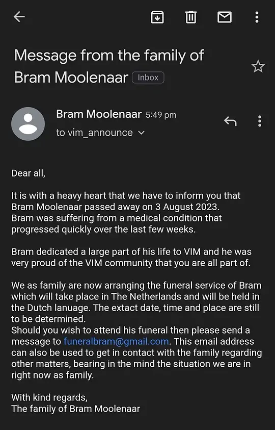

{: .right w="350" h="600" .shadow }

在病床上看到Bram Moolenaar去世的消息。

迄今为止用Vim居然已经七年，它对我的影响极其深远。去年底算是切到了Neovim，但依然固执地维护两套随时能够切换的配置，一个又一个的`has('vim')`判断下面是在各种细枝末节上努力保持行为一致的分支，有cmp就有coc，加入dap之后就必须复刻一份vimspector，不惜让配置工程变得无比庞大也要保证一切的起点和归宿始终在vimrc。

维护两套东西是与我的性格相悖的事情，但因为我对Vim有很执着的感情，总期待它哪天再次把NeoVim远远甩到后面，而那时我能够第一时间无缝转移。如今彻底回不去了。

NeoVim的样子始终让我抗拒，从对过于聒噪的社区的厌烦，到对Lua语言本身的审美的排斥，样样都让我想避而远之。我因为它的方便暂时选择了它，但从未放弃对Bram的耐心，只是知道他需要时间慢慢来，就像当年8.0的出现一样，尽管耗时甚久，却不会让任何人失望。

但我如今必须开始掌握Lua了。

Vim的个人风格过重，它必须由一个独断专制的天才去掌控，但矛盾的是，就算真的再有这样一个能掌控Vim的天才出现，想必他最不愿做的事情就是去接下别人遗留的充斥着个人印记的庞大项目，毕竟傲慢自负的心是开天辟地所必须的素质。所以Vim再有第二次生命的可能性基本为零。也许core team还能再给它续命一段时间，但灵魂已死，这种苟延残喘是种很凄凉的事情。

看着自己两千多行的vimrc，再次感受到了类似乔布斯去世时的悲哀。可以想见某一天这两千行的VimL会变成四千行甚至更长的臃肿丑陋的Lua。

我从vim9script中看到了Bram让Vim再次脱胎换骨的踌躇满志，可惜斯人已逝，再也不会有这一天。

R.I.P.
