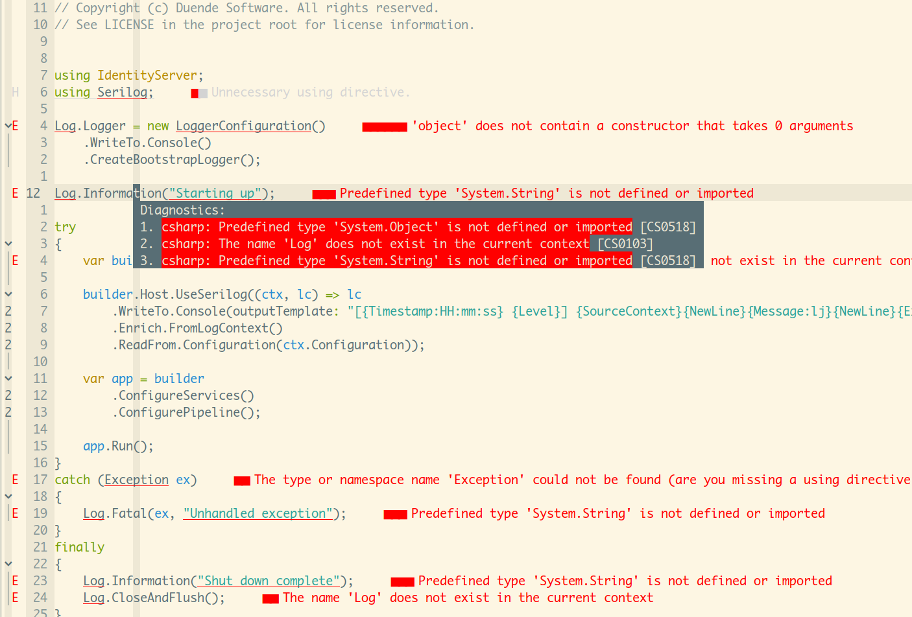

Updates: 

配置了VSCode之后NVim突然正常了，补全、跳转和诊断全都没问题

大致看日志，VSCode在初始化C#环境的时候额外对LSP做了一些调整，但暂时没找到具体的地方，后续抹掉环境重新来一次看看发生了什么，先放着


-----------------------------------------------------------------------------


从csharp-ls换到了omnisharp，参考多个issue调整很久还是这个鬼样子


放弃了，先用VSCode，等我学会C#再回来折腾

这个语言长得太像JAVA了，真难看




## 配置

```lua

local nvimpid = vim.fn.getpid()

lsp.omnisharp.setup({
    on_attach = on_attach,
    capabilities = capabilities,
    cmd = {
        "/bin/OmniSharp",
        "--languageserver",
        "--hostPID",
        tostring(nvimpid),
    },
    handlers = {
        ["textDocument/definition"] = require("omnisharp_extended").handler,
    },
})
```

## Refer

- https://aaronbos.dev/posts/csharp-dotnet-neovim
- https://github.com/OmniSharp/omnisharp-roslyn/wiki/Configuration-Options
- https://github.com/omnisharp/omnisharp-roslyn
